# Hawkeye Data Model ERD + DBML

This artifact is generated from the current SQLAlchemy models and includes recent schema tightening:

- `locations.location_type`, `locations.name`, `locations.code`
- `routing_rules.priority`, `routing_rules.effective_from`, `routing_rules.effective_to`
- `incident_events.assignment_id`
- `incidents.duplicate_reason`, `incidents.duplicate_confirmed_by_user_id`, `incidents.duplicate_confirmed_at`
- `authority_users.role_in_authority`, `authority_users.is_primary_contact`, `authority_users.is_active`, `authority_users.joined_at`

## ERD (Mermaid)

```mermaid
erDiagram
    USERS ||--o{ INCIDENTS : reports
    USERS ||--|| RESIDENT_PROFILES : has_profile
    USERS ||--o{ AUTHORITY_USERS : memberships
    AUTHORITIES ||--o{ AUTHORITY_USERS : members

    AUTHORITIES ||--o{ DEPARTMENT_CONTACTS : contacts
    INCIDENT_CATEGORIES ||--o{ INCIDENTS : category
    INCIDENT_CATEGORIES ||--o{ ROUTING_RULES : category_rules

    LOCATIONS ||--o{ LOCATIONS : parent_child
    LOCATIONS ||--o{ RESIDENT_PROFILES : municipality_district_ward
    LOCATIONS ||--o{ INCIDENTS : incident_location
    LOCATIONS ||--o{ ROUTING_RULES : location_scope

    AUTHORITIES ||--o{ INCIDENTS : current_and_suggested
    INCIDENTS ||--o{ INCIDENTS : duplicate_of

    INCIDENTS ||--o{ INCIDENT_MEDIA : media
    INCIDENTS ||--o{ INCIDENT_UPDATES : updates
    INCIDENTS ||--o{ NOTIFICATION_LOG : notifications
    INCIDENTS ||--o{ INCIDENT_ASSIGNMENTS : assignments
    INCIDENTS ||--o{ INCIDENT_DISPATCHES : dispatches
    INCIDENTS ||--o{ DEPARTMENT_ACTION_LOGS : department_actions
    INCIDENTS ||--o{ INCIDENT_EVENTS : events
    INCIDENTS ||--o{ INCIDENT_OWNERSHIP_HISTORY : ownership
    INCIDENTS ||--|| INCIDENT_SLA_TRACKING : sla_tracking

    AUTHORITIES ||--o{ INCIDENT_ASSIGNMENTS : authority_assignments
    USERS ||--o{ INCIDENT_ASSIGNMENTS : assigner_assignee
    INCIDENT_ASSIGNMENTS ||--o{ INCIDENT_DISPATCHES : assignment_dispatches

    AUTHORITIES ||--o{ INCIDENT_DISPATCHES : dispatch_target
    USERS ||--o{ INCIDENT_DISPATCHES : dispatcher_ack_user

    USERS ||--o{ INCIDENT_EVENTS : actor
    AUTHORITIES ||--o{ INCIDENT_EVENTS : authority
    INCIDENT_DISPATCHES ||--o{ INCIDENT_EVENTS : dispatch_event
    INCIDENT_ASSIGNMENTS ||--o{ INCIDENT_EVENTS : assignment_event
    INCIDENT_EVENTS ||--o{ NOTIFICATION_LOG : notification_source

    USERS ||--o{ INCIDENT_OWNERSHIP_HISTORY : assigned_by
    AUTHORITIES ||--o{ INCIDENT_OWNERSHIP_HISTORY : authority_owner
    INCIDENT_DISPATCHES ||--o{ INCIDENT_OWNERSHIP_HISTORY : source_dispatch

    USERS ||--o{ NOTIFICATION_LOG : recipient_user
    USERS ||--|| RESIDENT_NOTIFICATION_STATE : resident_seen_state
    USERS ||--|| ADMIN_NOTIFICATION_STATE : admin_seen_state
    USERS ||--|| ADMIN_PREFERENCES : admin_preferences
    USERS ||--o{ ADMIN_AUDIT_LOGS : admin_actor
    USERS ||--o{ AUDIT_LOGS : actor
```



## DBML (dbdiagram.io)

```dbml
Table users {
  id int [pk, increment]
  name varchar(120) [not null]
  email varchar(255) [not null, unique]
  password_hash varchar(255) [not null]
  role varchar(32) [not null]
  is_active boolean [not null, default: true]
  email_verified boolean [not null, default: false]
  phone_verified boolean [not null, default: false]
  last_login_at datetime
  invite_token varchar(64)
  invite_expires_at datetime
  created_at datetime [not null]
  updated_at datetime [not null]
}

Table resident_profiles {
  id int [pk, increment]
  user_id int [not null, unique]
  phone_number varchar(32)
  street_address_1 varchar(255)
  street_address_2 varchar(255)
  suburb varchar(120)
  city varchar(120)
  municipality_id int
  district_id int
  ward_id int
  postal_code varchar(20)
  latitude decimal(9,6)
  longitude decimal(9,6)
  location_verified boolean [not null, default: false]
  profile_completed boolean [not null, default: false]
  consent_location boolean [not null, default: false]
  share_anonymous_analytics boolean [not null, default: false]
  notify_incident_updates boolean [not null, default: true]
  notify_status_changes boolean [not null, default: true]
  notify_community_alerts boolean [not null, default: false]
  avatar_filename varchar(255)
  created_at datetime [not null]
  updated_at datetime [not null]
}

Table authorities {
  id int [pk, increment]
  name varchar(255) [not null]
  code varchar(80) [unique]
  slug varchar(120) [unique]
  authority_type varchar(50)
  contact_email varchar(255)
  contact_phone varchar(50)
  physical_address varchar(255)
  operating_hours varchar(120)
  service_hub varchar(120)
  jurisdiction_notes text
  is_active boolean [not null, default: true]
  routing_enabled boolean [not null, default: true]
  notifications_enabled boolean [not null, default: true]
  created_at datetime [not null]
  updated_at datetime [not null]
}

Table authority_users {
  id int [pk, increment]
  authority_id int [not null]
  user_id int [not null]
  job_title varchar(120)
  role_in_authority varchar(64)
  is_primary_contact boolean [not null, default: false]
  is_active boolean [not null, default: true]
  joined_at datetime [not null]
  can_assign boolean [not null, default: false]
  can_resolve boolean [not null, default: false]
  can_export boolean [not null, default: false]
  created_at datetime [not null]
  updated_at datetime [not null]

  indexes {
    (authority_id, user_id) [unique]
  }
}

Table department_contacts {
  id int [pk, increment]
  authority_id int [not null]
  contact_type varchar(24) [not null, default: "primary"]
  is_primary boolean [not null, default: false]
  is_secondary boolean [not null, default: false]
  channel varchar(24) [not null]
  value varchar(255) [not null]
  verification_status varchar(24) [not null, default: "unverified"]
  source_url varchar(512)
  notes text
  after_hours boolean [not null, default: false]
  is_active boolean [not null, default: true]
  created_at datetime [not null]
  updated_at datetime [not null]

  indexes {
    (authority_id, contact_type, channel, value) [unique]
  }
}

Table incident_categories {
  id int [pk, increment]
  name varchar(100) [not null, unique]
  description text
  department_hint varchar(150)
  default_priority varchar(32)
  default_sla_hours int
  is_active boolean [not null, default: true]
  created_at datetime [not null]
  updated_at datetime [not null]
}

Table locations {
  id int [pk, increment]
  location_type varchar(32)
  name varchar(150)
  code varchar(64) [unique]
  country varchar(100)
  province varchar(100)
  municipality varchar(150)
  district varchar(150)
  ward varchar(50)
  suburb varchar(150)
  area_name varchar(255)
  boundary_geojson text
  parent_location_id int
  created_at datetime [not null]
  updated_at datetime [not null]
}

Table routing_rules {
  id int [pk, increment]
  category_id int [not null]
  location_id int
  authority_id int [not null]
  priority_override varchar(32)
  sla_hours_override int
  priority int [not null, default: 100]
  effective_from datetime
  effective_to datetime
  is_active boolean [not null, default: true]
  created_at datetime [not null]
  updated_at datetime [not null]
}

Table incidents {
  id int [pk, increment]
  reported_by_id int [not null]
  resident_profile_id int
  title varchar(200) [not null]
  description text [not null]
  additional_notes text
  dynamic_details json
  category varchar(100) [not null]
  category_id int
  reported_category_id int
  final_category_id int
  resident_category_id int
  system_category_id int
  suburb_or_ward varchar(120) [not null]
  street_or_landmark varchar(255) [not null]
  nearest_place varchar(255)
  location varchar(255) [not null]
  validated_address varchar(255)
  suburb varchar(120)
  ward varchar(64)
  location_validated boolean [not null, default: false]
  location_id int
  latitude decimal(9,6)
  longitude decimal(9,6)
  location_precision varchar(32)
  geocoded_at datetime
  geocode_source varchar(64)
  hotspot_excluded boolean [not null, default: false]
  severity varchar(50) [not null]
  status varchar(32) [not null]
  version int [not null, default: 1]
  reference_code varchar(32) [not null, unique]
  current_authority_id int
  suggested_authority_id int
  suggested_priority varchar(50)
  screening_confidence float
  requires_admin_review boolean [not null, default: false]
  screening_notes text
  verification_status varchar(32) [not null, default: "pending"]
  verification_notes text
  verified_at datetime
  verified_by_user_id int
  proof_requested_at datetime
  proof_requested_by_user_id int
  proof_request_reason text
  evidence_resubmitted_at datetime
  escalated_at datetime
  escalated_by_user_id int
  is_anonymous boolean [not null, default: false]
  duplicate_of_incident_id int
  duplicate_reason text
  duplicate_confirmed_by_user_id int
  duplicate_confirmed_at datetime
  reported_at datetime
  acknowledged_at datetime
  assigned_at datetime
  resolved_at datetime
  closed_at datetime
  location_mode varchar(32)
  is_happening_now boolean
  is_anyone_in_danger boolean
  is_issue_still_present boolean
  urgency_level varchar(32)
  created_at datetime [not null]
  updated_at datetime [not null]
}

Table incident_media {
  id int [pk, increment]
  incident_id int [not null]
  file_path varchar(500) [not null]
  original_filename varchar(255)
  content_type varchar(100)
  filesize_bytes int
  uploaded_at datetime [not null]
}

Table incident_updates {
  id int [pk, increment]
  incident_id int [not null]
  updated_by_id int
  from_status varchar(32)
  to_status varchar(32) [not null]
  note text
  created_at datetime [not null]
}

Table incident_assignments {
  id int [pk, increment]
  incident_id int [not null]
  authority_id int [not null]
  assigned_to_user_id int
  assigned_by_user_id int
  assignment_reason text
  assigned_at datetime [not null]
  unassigned_at datetime
}

Table incident_dispatches {
  id int [pk, increment]
  incident_assignment_id int [not null]
  incident_id int [not null]
  authority_id int [not null]
  dispatch_method varchar(32) [not null, default: "internal_queue"]
  dispatched_by_type varchar(32) [not null]
  dispatched_by_id int
  destination_reference varchar(255)
  delivery_status varchar(32) [not null, default: "pending"]
  delivery_status_detail text
  ack_status varchar(32) [not null, default: "pending"]
  ack_user_id int
  ack_at datetime
  dispatched_at datetime [not null]
  delivery_confirmed_at datetime
  status varchar(30) [not null, default: "pending"]
  recipient_email varchar(255)
  subject_snapshot varchar(255)
  message_snapshot text
  delivery_provider varchar(64)
  delivery_reference varchar(255)
  failure_reason text
  external_reference_number varchar(120)
  external_reference_source varchar(120)
  delivered_at datetime
  resolved_at datetime
  closed_at datetime
  acknowledged_by varchar(255)
  resolution_note text
  resolution_proof_url varchar(512)
  last_status_update_at datetime
  reminder_count int [not null, default: 0]
  last_reminder_at datetime
  next_reminder_at datetime
  created_at datetime [not null]
  updated_at datetime [not null]
}

Table department_action_logs {
  id int [pk, increment]
  incident_id int [not null]
  authority_id int [not null]
  performed_by_id int
  action_type varchar(64) [not null]
  note text
  created_at datetime [not null]
}

Table incident_events {
  id int [pk, increment]
  incident_id int [not null]
  event_type varchar(64) [not null]
  from_status varchar(32)
  to_status varchar(32)
  actor_user_id int
  actor_role varchar(32)
  authority_id int
  dispatch_id int
  assignment_id int
  reason text
  note text
  metadata_json json
  created_at datetime [not null]
}

Table incident_ownership_history {
  id int [pk, increment]
  incident_id int [not null]
  authority_id int [not null]
  assigned_by_user_id int
  assigned_at datetime [not null]
  ended_at datetime
  is_current boolean [not null, default: true]
  dispatch_id int
  reason text
}

Table incident_sla_tracking {
  id int [pk, increment]
  incident_id int [not null, unique]
  status varchar(20) [not null, default: "open"]
  sla_hours int [not null, default: 72]
  deadline_at datetime [not null]
  breached_at datetime
  warning_sent_at datetime
  closed_at datetime
  created_at datetime [not null]
  updated_at datetime [not null]
}

Table notification_log {
  id int [pk, increment]
  incident_id int
  event_id int
  user_id int
  recipient_email varchar(255)
  type varchar(64) [not null]
  status varchar(32) [not null, default: "queued"]
  provider_message_id varchar(255)
  last_error text
  created_at datetime [not null]
  sent_at datetime
}

Table resident_notification_state {
  id int [pk, increment]
  user_id int [not null, unique]
  last_seen_at datetime [not null]
}

Table admin_notification_state {
  id int [pk, increment]
  user_id int [not null, unique]
  last_seen_at datetime [not null]
}

Table admin_preferences {
  id int [pk, increment]
  user_id int [not null, unique]
  show_kpi_cards boolean [not null, default: true]
  show_recent_incidents boolean [not null, default: true]
  show_overdue_panel boolean [not null, default: true]
  show_user_stats boolean [not null, default: true]
  notify_new_incident boolean [not null, default: false]
  notify_overdue_incident boolean [not null, default: false]
  daily_summary_enabled boolean [not null, default: false]
  default_landing_page varchar(32) [not null, default: "dashboard"]
  default_incident_sort varchar(32) [not null, default: "newest"]
  default_rows_per_page int [not null, default: 25]
  created_at datetime [not null]
  updated_at datetime [not null]
}

Table admin_audit_logs {
  id int [pk, increment]
  admin_user_id int
  action varchar(64) [not null]
  target_type varchar(32) [not null]
  target_id int [not null]
  details json
  created_at datetime [not null]
}

Table audit_logs {
  id int [pk, increment]
  entity_type varchar(32) [not null]
  entity_id int [not null]
  action varchar(64) [not null]
  actor_user_id int
  actor_role varchar(32)
  reason text
  before_json json
  after_json json
  metadata_json json
  created_at datetime [not null]
}

Ref: resident_profiles.user_id > users.id
Ref: resident_profiles.municipality_id > locations.id
Ref: resident_profiles.district_id > locations.id
Ref: resident_profiles.ward_id > locations.id

Ref: authority_users.authority_id > authorities.id
Ref: authority_users.user_id > users.id
Ref: department_contacts.authority_id > authorities.id
Ref: locations.parent_location_id > locations.id

Ref: routing_rules.category_id > incident_categories.id
Ref: routing_rules.location_id > locations.id
Ref: routing_rules.authority_id > authorities.id

Ref: incidents.reported_by_id > users.id
Ref: incidents.resident_profile_id > resident_profiles.id
Ref: incidents.category_id > incident_categories.id
Ref: incidents.reported_category_id > incident_categories.id
Ref: incidents.final_category_id > incident_categories.id
Ref: incidents.resident_category_id > incident_categories.id
Ref: incidents.system_category_id > incident_categories.id
Ref: incidents.location_id > locations.id
Ref: incidents.current_authority_id > authorities.id
Ref: incidents.suggested_authority_id > authorities.id
Ref: incidents.verified_by_user_id > users.id
Ref: incidents.proof_requested_by_user_id > users.id
Ref: incidents.escalated_by_user_id > users.id
Ref: incidents.duplicate_of_incident_id > incidents.id
Ref: incidents.duplicate_confirmed_by_user_id > users.id

Ref: incident_media.incident_id > incidents.id
Ref: incident_updates.incident_id > incidents.id
Ref: incident_updates.updated_by_id > users.id

Ref: incident_assignments.incident_id > incidents.id
Ref: incident_assignments.authority_id > authorities.id
Ref: incident_assignments.assigned_to_user_id > users.id
Ref: incident_assignments.assigned_by_user_id > users.id

Ref: incident_dispatches.incident_assignment_id > incident_assignments.id
Ref: incident_dispatches.incident_id > incidents.id
Ref: incident_dispatches.authority_id > authorities.id
Ref: incident_dispatches.dispatched_by_id > users.id
Ref: incident_dispatches.ack_user_id > users.id

Ref: department_action_logs.incident_id > incidents.id
Ref: department_action_logs.authority_id > authorities.id
Ref: department_action_logs.performed_by_id > users.id

Ref: incident_events.incident_id > incidents.id
Ref: incident_events.actor_user_id > users.id
Ref: incident_events.authority_id > authorities.id
Ref: incident_events.dispatch_id > incident_dispatches.id
Ref: incident_events.assignment_id > incident_assignments.id

Ref: incident_ownership_history.incident_id > incidents.id
Ref: incident_ownership_history.authority_id > authorities.id
Ref: incident_ownership_history.assigned_by_user_id > users.id
Ref: incident_ownership_history.dispatch_id > incident_dispatches.id
Ref: incident_sla_tracking.incident_id > incidents.id

Ref: notification_log.incident_id > incidents.id
Ref: notification_log.event_id > incident_events.id
Ref: notification_log.user_id > users.id

Ref: resident_notification_state.user_id > users.id
Ref: admin_notification_state.user_id > users.id
Ref: admin_preferences.user_id > users.id

Ref: admin_audit_logs.admin_user_id > users.id
Ref: audit_logs.actor_user_id > users.id
```
