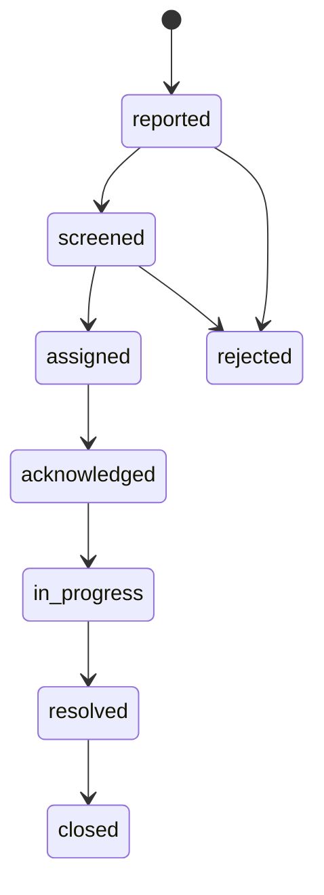

# HawkEye — Developer Implementation Plan
**Version 3.0 | March 2026 | Confidential — Development Team**

> This document defines the phased feature implementation roadmap for HawkEye, translating system requirements and feedback into concrete developer tasks.

---

## Table of Contents

1. [Executive Summary](#1-executive-summary)
2. [Core Architectural Principle](#2-core-architectural-principle)
3. [Requirements Traceability](#3-requirements-traceability)
4. [Current System State](#4-current-system-state)
5. [Phase 1 — Search, Filters, and Scale](#5-phase-1--search-filters-and-scale)
6. [Phase 2 — Location Intelligence](#6-phase-2--location-intelligence)
7. [Phase 3 — Workflow Hardening](#7-phase-3--workflow-hardening)
8. [Phase 4 — Analytics and Intelligence Layer](#8-phase-4--analytics-and-intelligence-layer)
9. [Phase 5 — Extended Platform Features](#9-phase-5--extended-platform-features)
10. [Database Migration Strategy](#10-database-migration-strategy)
11. [API Design Notes](#11-api-design-notes)
12. [Testing Requirements](#12-testing-requirements)
13. [Appendix — Key Design Questions](#13-appendix--key-design-questions-the-system-must-answer)

---

## 1. Executive Summary

HawkEye is a civic incident reporting and management platform built on Flask, PostgreSQL, and Docker. The system enables residents to report public infrastructure and safety issues, which are then screened, routed to responsible departments, and tracked through to resolution.

This implementation plan organises all required development work into five sequential phases. Each phase builds on the last, and the scope has been defined to move HawkEye from a basic reporting tool into a credible, accountable, and intelligent municipal operations platform.

| Phase | Focus | Timeline |
|-------|-------|----------|
| Phase 1 | Search, filtering, pagination, reference codes | Weeks 1–3 |
| Phase 2 | Location intelligence — Google Maps, geocoding | Weeks 4–6 |
| Phase 3 | Workflow hardening — dispatch, acknowledgment, action logs | Weeks 7–11 |
| Phase 4 | Analytics and intelligence layer | Weeks 12–16 |
| Phase 5 | Extended platform features — notifications, SLAs, trust features | Weeks 17–24 |

---

## 2. Core Architectural Principle

> **HawkEye must be built as an auditable incident workflow platform, not an incident list with editable statuses.**

### 2.1 The Wrong Model vs. The Right Model

A flat model adds columns to the `incidents` table over time:

```
incidents
  status, assigned_department, resolved_at, acknowledged_at,
  admin_note, proof_file, screened_by, routed_by, ...
```

This fails because one incident can have many status changes, many assignments, many notes, and many files over its lifetime. The flat model only stores the **latest snapshot** — it cannot answer: who changed the status, when was it first routed, was it rerouted, what did the department actually do?

The correct model separates concerns into four layers:

| Layer | Name | What It Contains |
|-------|------|-----------------|
| Layer 1 | Case Layer | Core incident record: reporter, description, location, category, current status. Stable facts that rarely change. |
| Layer 2 | Workflow Layer | How the case moved through the system: screening, routing, acknowledgment, status transitions, closure. |
| Layer 3 | Operational Evidence Layer | What people actually did: notes, dispatch records, action logs, proof file uploads, timestamps. |
| Layer 4 | Intelligence Layer | What the system learns from all incidents: hotspots, recurring failures, department performance, area risk patterns. |

### 2.2 The Five Non-Negotiable Design Decisions

These must be locked in now. Changing them later requires expensive refactoring.

| # | Decision | Why It Cannot Be Deferred |
|---|----------|--------------------------|
| 1 | Separate `current_status` from event history | The `incidents` table may keep `current_status` for query speed, but every important state change must also write a history record. Without this, audit trails, timelines, and analytics are impossible. |
| 2 | Separate routing (dispatch) from actions | A dispatch record means the incident was sent to a department. An action log means the department did something. These are different concepts and must be stored separately. |
| 3 | Store location as structured data | Raw address text is not enough. `latitude`, `longitude`, `validated_address`, and `suburb` must be stored from day one to enable mapping, routing, and hotspot detection. |
| 4 | Give every incident a reference code | A human-readable code (`HK-202603-001245`) is essential for search, support queries, and external communication. Retrofitting this later is messy. |
| 5 | Define public visibility rules now | Decide upfront which incident fields are public (category, area, status) and which are private (reporter identity, exact address, personal files). Changing this later creates privacy risk. |

### 2.3 What Ignoring This Principle Causes

| Problem | Effect |
|---------|--------|
| Fake accountability | Admin changes status to In Progress but there is no record of who received it or what action was taken. |
| No audit trail | Cannot prove whether the system routed correctly or whether a department ignored the case. |
| Weak analytics | Can count incidents but cannot analyse process bottlenecks, average response time, or department performance. |
| Poor resident UX | Residents see only a status badge with no meaningful timeline of actual events. |
| Painful future expansion | Every new requirement forces more columns onto `incidents`. This becomes serious technical debt within months. |

### 2.4 Required Database Shape

All tables below must exist before Phase 3 work begins.

| Group | Table | Purpose |
|-------|-------|---------|
| Main | `incidents` | Core case record — the stable facts of the incident |
| Main | `incident_categories` | Lookup table for category types |
| Main | `locations` | Named location entities for routing |
| Main | `departments` | Municipal departments and authorities |
| Main | `routing_rules` | Rules mapping category + location to department |
| Main | `users / roles` | System actors and their permissions |
| Workflow | `incident_status_history` | Immutable log of every status transition |
| Workflow | `incident_dispatches` | Record of every routing/dispatch event |
| Workflow | `incident_acknowledgments` | Department acknowledgment events |
| Workflow | `incident_actions` | Operational updates from departments |
| Supporting | `incident_evidence` | All files: resident uploads, dept. proof, admin attachments |
| Supporting | `incident_comments` | Internal notes and communication thread |
| Supporting | `analytics_hotspot_config` | Configurable thresholds for hotspot alerts (Phase 4) |

### 2.5 Operational Model & Lifecycle

HawkEye is an **incident operations system**, not just a reporting UI. All features must respect a single, explicit operational model that defines:

- **Actors**: Resident, Admin, Department (authority), and internal **System** services (screening, routing, SLAs).
- **Lifecycle**: A fixed set of states that every incident moves through.
- **Ownership**: Which actor or department is responsible at each step.
- **Evidence & audit**: What gets written to the event ledger and audit log on every meaningful action.

#### 2.5.1 Lifecycle states (contract)

The canonical lifecycle for all incidents is:



For v3 the **allowed statuses** are:

- `reported`
- `screened`
- `assigned` (previously “routed”)
- `acknowledged`
- `in_progress`
- `resolved`
- `closed`
- `rejected`

These are a **contract**. Adding, renaming, or removing statuses is a breaking change and must be reflected in the lifecycle diagrams, code, and database.

For each transition, the plan assumes:

| From → To | Allowed actors | Required records |
|----------|----------------|------------------|
| `[*]` → `reported` | System (resident submission) | `incident_events` (`incident_created`), optional `audit_logs` for anti‑abuse checks |
| `reported` → `screened` | Admin, System (screening engine) | `incident_events` (`status_changed`, `screening_completed`), `audit_logs` (if admin overrides system suggestion) |
| `screened` → `assigned` | Admin, System (auto‑routing) | `incident_events` (`incident_routed`), `incident_dispatches` row, ownership update |
| `assigned` → `acknowledged` | Department user | `incident_events` (`dispatch_acknowledged`), update `incident_dispatches.ack_status`, ownership update |
| `acknowledged` → `in_progress` | Department user | `incident_events` (`status_changed`), may create `incident_ownership_history` entry (technician level, future) |
| `in_progress` → `resolved` | Department user | `incident_events` (`status_changed`, `work_completed`), related action logs/evidence |
| `resolved` → `closed` | Admin, System (auto after verification window) | `incident_events` (`status_changed`), `audit_logs` if manually overridden |
| `reported`/`screened` → `rejected` | Admin | `incident_events` (`status_changed`, `incident_rejected`), required `reason`, `audit_logs` entry |

**Rule:** All code paths that change `Incident.status` must go through a single service method (see §2.5.4) which validates transitions and writes the required records **atomically**.

##### Lifecycle Transition Matrix

| From | To | Allowed Actors | Reason Required | Audit Required |
|------|-----|----------------|-----------------|----------------|
| * | reported | System | No | Optional |
| reported | screened | Admin, System | No | If override |
| screened | assigned | Admin, System | No | No |
| assigned | acknowledged | Department | No | No |
| acknowledged | in_progress | Department | No | No |
| in_progress | resolved | Department | No | No |
| resolved | closed | Admin, System | Yes if manual | Yes if manual |
| reported/screened/assigned | rejected | Admin | Yes | Yes |

#### 2.5.2 Core data backbone

The workflow and accountability model is backed by four core tables, which complement (and in some cases supersede) the earlier v2 tables like `incident_status_history`, `incident_dispatch`, and `department_action_log`:

1. `incident_events` — the immutable **incident event ledger**.
2. `incident_dispatches` — **proof of dispatch and delivery** to departments.
3. `incident_ownership_history` — **who owns the incident when**.
4. `audit_logs` — cross‑entity **governance log** for sensitive changes.

These are **first‑class, non‑optional** for any new workflow or routing feature.

##### 2.5.2.1 `incident_events`

| Field | Type | Notes |
|-------|------|-------|
| id | SERIAL PK | |
| incident_id | INTEGER FK | |
| event_type | VARCHAR(64) | Controlled constants |
| from_status | VARCHAR(32) | Nullable |
| to_status | VARCHAR(32) | Nullable |
| actor_user_id | INTEGER FK | Nullable for system |
| actor_role | VARCHAR(32) | resident \| admin \| system \| department |
| authority_id | INTEGER FK | Nullable |
| dispatch_id | INTEGER FK | Nullable |
| reason | TEXT | Nullable |
| note | TEXT | Nullable |
| metadata_json | JSONB | Nullable |
| created_at | TIMESTAMP | |

**Event types:** `incident_created`, `incident_screened`, `incident_assigned`, `incident_acknowledged`, `status_changed`, `incident_resolved`, `incident_closed`, `incident_rejected`, `ownership_changed`, `dispatch_created`, `dispatch_delivered`, `evidence_uploaded`, `manual_override`

**Rules:**
- Immutable after insert
- One row per domain event
- Must exist for every status transition

##### 2.5.2.2 `incident_dispatches`

- Purpose: model **dispatch and delivery** as a first‑class concept, not just a field on `Incident`.
- Primary link:
  - `incident_assignment_id` → `IncidentAssignment.id` (existing assignment model).
  - Redundant `incident_id` and `authority_id` may be stored for direct querying.
- Minimum fields:
  - `id`
  - `incident_assignment_id`
  - `incident_id`
  - `authority_id`
  - `dispatched_by_type` (`admin | system`)
  - `dispatched_by_id`
  - `dispatch_method` (`internal_queue | email | sms | api`)
  - `destination_reference` (queue name, email address, API endpoint, etc.)
  - `delivery_status` (`pending | sent | delivered | failed`)
  - `delivery_status_detail` (provider error text, bounce reason, etc.)
  - `ack_status` (`pending | acknowledged | rejected`)
  - `ack_user_id`, `ack_at`
  - `dispatched_at`, `delivery_confirmed_at`

Plan‑level rule: **Every routing or assignment must create (or update) an `incident_dispatches` row**, and department queues should ultimately be driven from this table plus `Incident.status`, not just `incident.current_authority_id`.

##### Department Queue Logic

- **Incoming / Unacknowledged:** dispatched + active + `ack_status != acknowledged`
- **Acknowledged / Pending Work:** current ownership + status = `acknowledged`
- **In Progress:** current ownership + status = `in_progress`
- **Completed:** resolved or closed

##### 2.5.2.3 `incident_ownership_history`

| Field | Type | Notes |
|-------|------|-------|
| id | SERIAL PK | |
| incident_id | INTEGER FK | |
| authority_id | INTEGER FK | |
| assigned_by_user_id | INTEGER FK | Nullable |
| assigned_at | TIMESTAMP | |
| ended_at | TIMESTAMP | Nullable |
| is_current | BOOLEAN | Exactly one TRUE per incident |
| dispatch_id | INTEGER FK | Nullable |
| reason | TEXT | Nullable |

**Rules:**
- Exactly one current ownership row per incident
- Ownership must close before reassignment

##### 2.5.2.4 `audit_logs`

| Field | Type | Notes |
|-------|------|-------|
| id | SERIAL PK | |
| entity_type | VARCHAR(32) | incident, routing_rule, user, etc |
| entity_id | INTEGER | |
| action | VARCHAR(64) | |
| actor_user_id | INTEGER FK | Nullable |
| actor_role | VARCHAR(32) | |
| reason | TEXT | Required for sensitive actions |
| before_json | JSONB | Nullable |
| after_json | JSONB | Nullable |
| metadata_json | JSONB | Nullable |
| created_at | TIMESTAMP | |

Plan‑level rule: **All sensitive changes (status transitions, routing and rule changes, role/permission changes, deletions) must write an `audit_logs` row.**

> Note: the existing `AdminAuditLog` model can either be evolved to match this shape or wrapped behind an `AuditLogService` that writes to the new table while keeping legacy consumers working.

#### 2.5.3 Mapping to existing services and models

To avoid rewriting working code, the backbone is introduced by extending existing components:

| Component | Role in backbone |
|----------|------------------|
| `IncidentService` (`app/services/incident_service.py`) | **Single entry point** for status transitions. Responsible for validating transitions, updating `Incident.status`, writing `incident_events`, updating `incident_ownership_history`, and triggering audit/notification hooks in one transaction. |
| `RoutingService` + `RoutingRule` | When a routing decision is made, must create or update `IncidentAssignment`, write an `incident_dispatches` row, and emit `incident_events` entries (`incident_routed`, `ownership_changed`). |
| `IncidentAssignment` | Continues to represent the logical link between an incident and an authority; dispatch records reference it. |
| `AdminAuditLog` / `audit_logs` | All admin‑initiated sensitive actions (user role changes, manual closes, routing overrides, preference changes) write to the unified audit log. |

This mapping should be used when designing future features (e.g. SLAs, escalation rules, analytics) so they plug into the backbone instead of creating new, disconnected state.

#### 2.5.4 Phased backbone rollout

To keep delivery realistic and avoid destabilising the system, the backbone is implemented in four phases that align with the main roadmap:

1. **Phase A – Event ledger**
   - Introduce `incident_events` schema and minimal ORM model.
   - Wire incident creation, screening, routing, and status changes to write events.
   - Update resident/admin timelines to read from `incident_events` (even if only a subset of events are recorded initially).
2. **Phase B – Dispatch records**
   - Introduce `incident_dispatches` schema.
   - On any assignment/routing, create dispatch records and display dispatch/delivery/ack status in admin and department views.
3. **Phase C – Ownership history**
   - Introduce `incident_ownership_history`.
   - Move all “who currently owns this?” semantics into this table, with `is_current` as the single source of truth.
   - Render current owner and history in admin UI using this table.
4. **Phase D – Audit log unification**
   - Introduce or evolve `audit_logs` and consolidate sensitive changes into it (may wrap/replace `AdminAuditLog`).
   - Add admin‑facing tools later to inspect audit entries (search/filter/export), but logging must be in place first.

Once these phases are complete and wired into services, lifecycle behaviour that currently feels “wack” (silent status changes, unclear delivery, ambiguous ownership) becomes constrained by a **clear, enforceable contract** shared by documentation, database, and code.

#### 2.5.5 Single control surface for status changes

All `Incident.status` changes are owned by a single service API:

- Service: `IncidentService` (`app/services/incident_service.py`)
- Method: `change_status(incident, new_status, *, actor_type, actor_id, reason=None, metadata=None)`

**Contract for `IncidentService.change_status`:**

1. **Validate transition**
   - Read current status from the `incident` instance.
   - Validate that `(old_status, new_status, actor_type)` is allowed by the lifecycle rules in §2.5.1.
   - Reject illegal transitions (e.g. `reported → resolved`, `assigned → closed`) by raising a domain‑level error.
2. **Update status**
   - Set `incident.status = new_status`.
3. **Write event ledger entry**
   - Create an `incident_events` row with:
     - `event_type = 'status_changed'`
     - `old_status`, `new_status`
     - `actor_type`, `actor_id`
     - optional `reason` / `metadata` payload.
4. **Update ownership, where applicable**
   - Close the current `incident_ownership_history` row (`ended_at`, `is_current = false`) if ownership is changing.
   - Insert a new `incident_ownership_history` row when the responsible owner changes (for example, `screened → assigned` moves ownership to the department; `resolved → closed` may release ownership back to admin or system).
5. **Write audit log**
   - Create an `audit_logs` row with:
     - `entity_type = 'incident'`, `entity_id = incident.id`
     - `action_type = 'status_change'`
     - `before_json` / `after_json` focused on status + owner
     - `actor_type`, `actor_id`
     - optional `reason`.
6. **Wrap in a single transaction**
   - Status, event, ownership, and audit writes must be committed (or rolled back) together so the system never shows a status that is missing its corresponding ledger entries.

**Enforcement rules:**

- Routes, repositories, background jobs, and tests must **not** set `incident.status` directly; they must always call `IncidentService.change_status(...)`.
- All UI flows (resident, department, admin) that move an incident along the lifecycle must do so via this service method.

##### acknowledge_dispatch

**Method:** `acknowledge_dispatch(dispatch_id, actor_user_id, note=None, channel="internal_queue")`

**Actions:**
- Set `ack_status = acknowledged`
- Set `ack_user_id`
- Set `ack_at`
- Write `incident_events` row
- Call `change_status(assigned → acknowledged)`

##### Architectural Discipline

Do not allow `incident_events` to become a loose log table.

Rules:
- One row per domain event
- Immutable after insert
- Controlled event type constants
- Consistent status change recording
- Actor and timestamp always present
- Reasons required when policy dictates

---

## 3. Requirements Traceability

Each critique point translated into a system requirement and the feature that satisfies it.

| Problem Raised | What the System Must Do | Feature / Phase |
|----------------|------------------------|-----------------|
| Residents cannot navigate large incident lists — what if a user has 1000 incidents? | Residents must find incidents quickly by reference number, keyword, category, status, date range, and area. | **Resident Incident Explorer** — search, filters, sorting, pagination. Phase 1. |
| Residents should see incidents in their area for transparency and community awareness. | Allow residents to view public incidents nearby, with private data (name, phone, address) hidden. | **Area Incident Viewer** — suburb/ward-scoped public view. Phase 2. |
| Typed addresses are inconsistent and unreliable for routing and analytics. | Validate and standardise all location data using Google Maps, storing lat/lng and formatted address. | **Google Maps Location Validation** — autocomplete, pin drop, geocoding. Phase 2. |
| When admin escalates an incident, there must be proof the department received it. | Create an official dispatch record capturing the send timestamp, department, and acknowledgment. | **Incident Dispatch Tracking** — dispatch + acknowledgment tables. Phase 3. |
| Departments must do more than update a status field — they must record actual work. | Allow departments to log operational actions with notes, job references, and proof files. | **Department Action Logs** — action_log table with evidence uploads. Phase 3. |
| Residents should see what is happening step by step, not just a status badge. | Each incident must expose a full activity timeline showing timestamps, actors, and notes per step. | **Incident Activity Timeline** — per-incident event feed. Phase 3. |
| If many burst pipes occur in one area, the system should detect and report that. | Analyse incident data to detect hotspots, recurring failures, and infrastructure trends. | **Incident Analytics Engine** — clustering, trend detection, alerts. Phase 4. |
| Screening must work reliably and route incidents to the correct department. | Assist classification using category + location + routing rules; support automated routing with admin oversight. | **Improved Screening Engine and Automated Routing**. Phase 3 (rules), Phase 4 (automation). |
| Admin should not have to manually route every incident as volume grows. | Auto-route high-confidence incidents using routing rules; admin reviews exceptions only. | **Automated Incident Routing** with confidence scoring. Phase 3 partial, Phase 4 full. |

---

## 4. Current System State

| Feature | Status | Notes |
|---------|--------|-------|
| Role-based user system (Resident, Admin, Authority) | ✅ Done | Full RBAC with separate dashboards |
| Resident incident reporting form | ✅ Done | Category, description, location, media |
| Incident storage in PostgreSQL | ✅ Done | Core fields present |
| Media / evidence upload | ✅ Done | Images stored, admin can view |
| Incident status updates by admin | ✅ Done | Manual; no structured lifecycle |
| Routing rules by category and location | ✅ Done | Semi-automated; admin oversight required |
| Admin dashboard | ✅ Done | Incident review, routing, media viewing |
| Authority incident view | ✅ Done | Assigned incidents visible to dept. |
| Docker + PostgreSQL environment | ✅ Done | Dev and deploy environments |
| Routing automation (confidence scoring) | 🟡 Partial | Logic is basic; no confidence score |
| Incident workflow (structured lifecycle) | 🟡 Partial | Statuses exist but no ack. or action logs |
| Location handling | 🟡 Partial | Structured fields present; no map validation yet |
| Public incident visibility for residents | 🟡 Partial | Own incidents only; no area view |
| Reference codes (`HK-YYYY-MM-XXXXXX`) | 🟡 Partial | Generated on create; uniqueness not enforced at DB level yet |
| Resident incident search & filters | 🟡 Partial | Server-side search + status/date/area filters with pagination implemented |
| Admin incident search & filters | 🟡 Partial | Queue supports search, status, priority, department, date, area filters with pagination |
| Google Maps integration | ❌ Not started | Phase 2 target |
| Incident timeline view | ❌ Not started | Phase 3 target |
| Department acknowledgment system | ❌ Not started | Phase 3 target |
| Dispatch records | ❌ Not started | Phase 3 target |
| Department action logs with proof | ❌ Not started | Phase 3 target |
| Analytics and hotspot detection | ❌ Not started | Phase 4 target |
| Map-based incident visualisation | ❌ Not started | Phase 4 target |

---

## 5. Phase 1 — Search, Filters, and Scale
**Timeline: Weeks 1–3**

Phase 1 makes the incident list usable at scale. Without search and filtering, residents and admins will struggle as incident volume grows. All tasks in this phase must be completed before Phase 2 begins. Some work is already in place (reference numbers, basic admin console, and the resident incident explorer); this phase hardens and completes those capabilities.

| Task | Effort | Priority |
|------|--------|----------|
| Ensure `reference_code`/`reference_no` follows `HK-YYYY-MM-XXXXXX` format and is unique | 2–3 hrs | HIGH |
| Auto-generate reference code on incident creation in the service layer | 1–2 hrs | HIGH |
| Add/confirm search bar on resident incident list (reference, keyword, address) | 2–3 hrs | HIGH |
| Add/confirm filter panel: date range, status, category, area | 2–3 hrs | HIGH |
| Implement/extend server-side filtering in `resident_routes` and `admin_routes` (including date and area) | 3–4 hrs | HIGH |
| Ensure pagination (20–25 incidents per page) on all incident lists | 2–3 hrs | HIGH |
| Add sort options: newest, oldest, status, priority | 2 hrs | MED |
| Add quick-filter shortcuts: My Open Incidents, My Resolved, This Month | 2–3 hrs | MED |
| Align admin incident queue with resident explorer capabilities | 3–4 hrs | HIGH |
| Write unit tests for search and filter service functions | 3 hrs | MED |

### 5.1 Reference Code Format

Every incident must receive a unique, human-readable reference code at creation time:

```
HK-2026-03-001245

Components:
  HK      = HawkEye prefix
  2026    = year
  03      = zero-padded month
  001245  = zero-padded sequential number (resets yearly)
```

Generate this in the **service layer**, not in the route. Use a database sequence or atomic counter to prevent duplicates under concurrent submissions.

### 5.2 Search and Filter Architecture

All filtering must be performed **server-side** through SQLAlchemy query composition. Never load all incidents into memory and filter in Python.

Filter parameters to support:

| Parameter | Type | Description |
|-----------|------|-------------|
| `q` | string | Full text search: `reference_code`, `description`, `location_text` |
| `status` | string | One of: `reported`, `screened`, `assigned`, `acknowledged`, `in_progress`, `resolved`, `closed`, `rejected` |
| `category_id` | integer | Foreign key filter |
| `date_from` | ISO date | Start of date range |
| `date_to` | ISO date | End of date range |
| `area` | string | Matches suburb or ward string |
| `page` | integer | Page number |
| `per_page` | integer | Results per page (default: 20) |

### 5.3 UI Layout for Incident Explorer

1. Search bar spanning full width at top
2. Filter row below: status chips, category dropdown, date range picker
3. Sort control on the right
4. Incident cards or table rows below
5. Pagination controls at the bottom

---

## 6. Phase 2 — Location Intelligence
**Timeline: Weeks 4–6**

Phase 2 replaces free-text address input with validated, georeferenced location data using Google Maps APIs. This enables map-based views, proximity searches, and geographic analytics in later phases.

| Task | Effort | Priority |
|------|--------|----------|
| Add `latitude`, `longitude`, `validated_address` columns to incidents table | 1–2 hrs | HIGH |
| Add Google Maps Places Autocomplete to incident report form | 4–5 hrs | HIGH |
| Add map pin drop option as alternative to address search | 3–4 hrs | HIGH |
| Implement reverse geocoding (pin → formatted address) | 2–3 hrs | HIGH |
| Store lat/lng and `validated_address` on incident creation and edit | 2 hrs | HIGH |
| Add location confidence/validation flag to incidents table | 1 hr | MED |
| Migrate existing incidents: attempt geocoding from `location_text` | 3–4 hrs | MED |
| Add ward/suburb extraction from geocoding result | 2 hrs | MED |
| Enable location-based filtering (by suburb or ward) | 2–3 hrs | MED |
| Add basic incident map view for admin (markers from lat/lng) | 5–6 hrs | MED |
| Write integration tests for geocoding service | 2–3 hrs | MED |

### 6.1 Google Maps APIs Required

Enable in Google Cloud Console:
- **Places API** — address autocomplete
- **Geocoding API** — converting addresses to coordinates
- **Maps JavaScript API** — interactive map UI

> Store the API key in environment variables. Never commit to source code. Use separate keys for backend and frontend if billing separation is needed.

### 6.2 Location Fields Added to Incidents Table

| Column | Type | Notes |
|--------|------|-------|
| `latitude` | `NUMERIC(10,7)` | From geocoding or map pin |
| `longitude` | `NUMERIC(10,7)` | From geocoding or map pin |
| `validated_address` | `VARCHAR(512)` | Formatted address from Google |
| `suburb` | `VARCHAR(128)` | Extracted from address components |
| `ward` | `VARCHAR(128)` | Ward or zone if available |
| `location_validated` | `BOOLEAN` | True if geocoded successfully |

### 6.3 User Experience Flow

**Option A — Address search:**
1. Resident types address into Places Autocomplete field
2. Autocomplete suggests matching addresses
3. Resident selects an address
4. System geocodes the selection and pins the map
5. Lat/lng and formatted address are stored

**Option B — Map pin:**
1. Resident opens map view
2. Resident drops a pin on the location
3. System reverse-geocodes the pin to get formatted address
4. Address is shown for confirmation
5. Lat/lng and formatted address are stored

**Option C — Use my current location:**
1. Resident selects "Use my current location"
2. Browser prompts for location permission
3. Loading states: "Detecting your current location...", "Getting address details..."
4. Map centers on GPS coordinates, marker placed
5. Reverse geocode populates suburb, street, nearest place (preferring short POI/establishment over full address)
6. Success message and helper text shown; "Detect again" button available
7. All fields editable; pin draggable for refinement
8. If permission denied: inline help explains how to enable in browser; map remains for manual pin placement

### 6.4 Current Location UX Enhancements (Implemented)

The "Use my current location" flow has been refined for production-ready UX:

| Improvement | Description |
|-------------|-------------|
| Loading states | "Detecting your current location..." during GPS; "Getting address details..." during reverse geocode |
| Success feedback | "Location detected successfully. You can edit the address or drag the pin if needed." |
| Helper text | "Auto-filled from your current location. You can edit these details or drag the pin." |
| Detect again | Button to retry geolocation without switching options |
| Permission denied | Inline help (no blocking alerts) with Chrome/site settings instructions |
| Autofill mapping | Suburb: sublocality/locality; Street: route; Nearest place: point_of_interest/establishment/neighborhood preferred |
| Fallback | Full formatted address only when no short place found |
| Editable fields | All autofilled fields remain editable; pin draggable |

---

## 7. Phase 3 — Workflow Hardening
**Timeline: Weeks 7–11**

Phase 3 is the most substantial phase. It introduces a structured incident lifecycle, dispatch records, department acknowledgment, action logging with proof of work, and the incident timeline view. This is where HawkEye becomes a genuinely accountable system.

| Task | Effort | Priority |
|------|--------|----------|
| Create `incident_status_history` table for full audit trail | 2–3 hrs | HIGH |
| Trigger history log entry on every status change | 2 hrs | HIGH |
| Update incident lifecycle states to 7 official statuses | 2–3 hrs | HIGH |
| Create `incident_dispatch` table (dispatch records per routing event) | 2–3 hrs | HIGH |
| Write service to create dispatch record when admin routes incident | 2 hrs | HIGH |
| Create acknowledgment flow for departments (button + service + DB write) | 4–5 hrs | HIGH |
| Create `department_action_log` table | 1–2 hrs | HIGH |
| Allow departments to post action updates with notes and file uploads | 4–5 hrs | HIGH |
| Build incident timeline UI component (per-step timestamps and actors) | 5–6 hrs | HIGH |
| Show timeline on resident incident detail page | 2–3 hrs | HIGH |
| Show timeline on admin incident detail page with extended fields | 2–3 hrs | HIGH |
| Add screening step: admin confirms category and routing before dispatch | 3–4 hrs | MED |
| Add routing confidence score field and display in admin triage queue | 3–4 hrs | MED |
| Enable public area incident view for residents (anonymised) | 3–4 hrs | MED |
| Write API endpoint tests for dispatch and acknowledgment flows | 3–4 hrs | MED |

### 7.1 Incident Lifecycle States

```
reported → screened → assigned → acknowledged → in_progress → resolved → closed
                                                                ↘ rejected
```

| Status | Controlled By | Meaning |
|--------|--------------|---------|
| reported | System | Resident has submitted the incident (initial capture). |
| screened | Admin / System | Admin or screening engine has reviewed and normalised the report. |
| assigned | Admin / System | Incident has been dispatched/assigned to a department (authority). |
| acknowledged | Department | Department has confirmed receipt of the assignment. |
| in_progress | Department | Active work is underway on the incident. |
| resolved | Department | Department indicates the issue has been fixed (pending verification). |
| closed | Admin / System | Finalised after verification period or admin review. |
| rejected | Admin | Marked invalid, duplicate, or out of scope, with a required reason. |

All status changes above must be executed via `IncidentService.change_status(...)`, which enforces the allowed transitions and writes the associated event, ownership, and audit records described in §2.5.

### 7.2 New Database Tables

#### `incident_status_history`

| Column | Type | Notes |
|--------|------|-------|
| `id` | `SERIAL PK` | Auto-increment |
| `incident_id` | `INTEGER FK` | References `incidents.id` |
| `old_status` | `VARCHAR(50)` | Previous status value |
| `new_status` | `VARCHAR(50)` | New status value |
| `changed_by` | `INTEGER FK` | References `users.id` |
| `changed_at` | `TIMESTAMP` | Defaults to `NOW()` |
| `note` | `TEXT` | Optional reason or admin note |

#### `incident_dispatch`

| Column | Type | Notes |
|--------|------|-------|
| `id` | `SERIAL PK` | Auto-increment |
| `incident_id` | `INTEGER FK` | References `incidents.id` |
| `department_id` | `INTEGER FK` | References department/authority |
| `dispatched_by` | `INTEGER FK` | Admin or system user ID |
| `dispatched_at` | `TIMESTAMP` | Defaults to `NOW()` |
| `dispatch_method` | `VARCHAR(50)` | `manual` or `auto` |
| `acknowledgment_status` | `VARCHAR(50)` | `pending`, `acknowledged`, `rejected` |
| `acknowledged_by` | `INTEGER FK NULL` | Dept. user who acknowledged |
| `acknowledged_at` | `TIMESTAMP NULL` | Timestamp of acknowledgment |
| `response_note` | `TEXT NULL` | Optional note from department |

#### `department_action_log`

| Column | Type | Notes |
|--------|------|-------|
| `id` | `SERIAL PK` | Auto-increment |
| `incident_id` | `INTEGER FK` | References `incidents.id` |
| `department_id` | `INTEGER FK` | Department performing action |
| `action_type` | `VARCHAR(100)` | e.g. `technician_assigned`, `work_order`, `resolved` |
| `note` | `TEXT NULL` | Free text update |
| `proof_file_path` | `VARCHAR(512) NULL` | Path to uploaded evidence file |
| `created_by` | `INTEGER FK` | User who logged the action |
| `created_at` | `TIMESTAMP` | Defaults to `NOW()` |

### 7.3 Incident Timeline Component

Every incident detail page must render a vertical timeline. Each step shows:

- Step name and status badge
- Timestamp (date and time)
- Actor name or role who triggered the step
- Optional note or action reference
- Proof evidence link if a file was attached

Steps not yet reached must be shown in a greyed-out pending state so residents can see what comes next.

### 7.4 Implementation roadmap for lifecycle and backbone

To avoid ad-hoc changes and rework, the lifecycle and operational backbone should be implemented in the following sequence:

1. Add `acknowledged` to enum and transition map
2. Add `incident_events` table
3. Refactor `change_status(...)` to always write event rows
4. Remove direct status writes (including `create_incident`)
5. Add `incident_ownership_history`
6. Tie assignment flow to ownership creation
7. Add `audit_logs`
8. Add acknowledgment service
9. Refactor timeline to read from `incident_events`
10. Add tests

### 7.5 Operational Backbone — GitHub Issues

1. Add `incident_events` model, migration, repository
2. Add `incident_ownership_history` model and ownership service
3. Refactor `IncidentService.change_status` into canonical status engine
4. Add `audit_logs` model and sensitive action logging
5. Implement dispatch acknowledgment workflow
6. Refactor department queues
7. Rebuild timelines from `incident_events`
8. Department UI — Acknowledge incident
9. Add workflow and audit integration tests

---

## 8. Phase 4 — Analytics and Intelligence Layer
**Timeline: Weeks 12–16**

| Task | Effort | Priority |
|------|--------|----------|
| Create analytics service layer (separate from routes) | 3–4 hrs | HIGH |
| Build incident trend query: volume by category and date range | 3–4 hrs | HIGH |
| Build hotspot detection: areas with X+ incidents in 30 days | 4–5 hrs | HIGH |
| Build recurring incident detector: same location, repeated category | 3–4 hrs | HIGH |
| Build department performance metrics: avg. response and resolution time | 3–4 hrs | HIGH |
| Add analytics dashboard page for admin (charts and summary tables) | 6–8 hrs | HIGH |
| Add map view with incident cluster markers and category filters | 5–6 hrs | MED |
| Add area heatmap layer to map based on incident density | 4–5 hrs | MED |
| Build hotspot alert system: flag to admin when threshold exceeded | 3–4 hrs | MED |
| Add top-10 tables: categories, areas, departments by volume and delay | 3–4 hrs | MED |
| Add CSV/PDF export for monthly analytics reports | 4–5 hrs | LOW |
| Evaluate and stub out ML classification layer for future use | 3–4 hrs | LOW |

### 8.1 Core Analytics Queries

All queries must be implemented in a dedicated `analytics_service.py` module and exposed through admin-only routes.

**Incident Volume by Category**
Group incidents by category over a configurable date range. Return counts per category for charting.

**Geographic Hotspot Detection**
Group incidents by suburb or ward within a 30-day rolling window. Flag any area where the incident count exceeds a configurable threshold (default: 10). Return hotspot areas with incident counts, categories, and status breakdown.

**Recurring Incident Detection**
Find incidents sharing the same `validated_address` or lat/lng cluster with the same category, occurring more than once within 90 days. Flag as potential infrastructure root-cause cases requiring inspection.

**Department Performance Metrics**
For each department, calculate:
- Average time from dispatch to acknowledgment
- Average time from acknowledgment to resolved status
- Number of incidents unacknowledged past 24 hours
- Number of incidents in progress past 7 days without an action log update

### 8.2 Hotspot Threshold Configuration

Thresholds must be configurable per incident category, not globally fixed. Store in `analytics_hotspot_config` table so admins can tune them without code changes. Example: 5 burst pipe reports in one area in 7 days may warrant escalation, while 5 noise complaints in 30 days may not.

### 8.3 Analytics Dashboard Layout

Sections in order:
1. Summary cards: total incidents this month, open, resolved, overdue
2. Volume trend line chart: incidents per day over the last 90 days
3. Category breakdown bar chart: top 10 categories this month
4. Hotspot table: areas exceeding thresholds, sortable by severity
5. Department performance table: response time and resolution time per dept.
6. Map with incident cluster markers and heatmap toggle

---

## 9. Phase 5 — Extended Platform Features
**Timeline: Weeks 17–24**

These features elevate HawkEye from an operational tool to a trusted civic platform. They address the full resident experience, department accountability, notification infrastructure, and long-term intelligence.

---

### 9.1 Resident Experience Upgrades

#### Satisfaction Rating After Closure
When an incident is marked Resolved, prompt the resident with a 1–5 star rating and optional comment. This:
- Creates a department accountability feedback loop
- Flags fake resolutions (dept. marks resolved, resident rates 1 star and says "nothing was done")
- Surfaces systemic issues to admin

| Task | Effort | Priority |
|------|--------|----------|
| Add `resident_rating` and `resident_feedback` fields to incidents | 1 hr | HIGH |
| Trigger rating prompt to resident when status changes to Resolved | 2–3 hrs | HIGH |
| Display average rating per department on admin dashboard | 2 hrs | HIGH |
| Flag incidents where rating ≤ 2 for admin review | 1–2 hrs | MED |

#### Anonymous Reporting Option
Some incidents — crime, illegal dumping, community conflict — will not be reported if the resident must identify themselves. A verified-but-anonymous mode where the system knows who submitted but departments never see the identity would significantly increase reporting volume on sensitive categories.

| Task | Effort | Priority |
|------|--------|----------|
| Add `is_anonymous` flag to incidents | 1 hr | HIGH |
| Strip reporter identity from all department-facing views when flag is set | 2–3 hrs | HIGH |
| Show "Anonymous Report" label in dispatch and action log views | 1 hr | MED |

#### Duplicate Detection Before Submission
Before a resident submits, the system checks for existing open reports within 200m matching the same category. The resident is shown: "3 similar reports already exist nearby — view them or add your report as supporting evidence." This:
- Reduces noise and spam
- Clusters related reports automatically
- Makes the resident feel informed rather than ignored

| Task | Effort | Priority |
|------|--------|----------|
| Build proximity + category match query (lat/lng radius search) | 3–4 hrs | HIGH |
| Show nearby incidents panel before submission confirmation | 3–4 hrs | HIGH |
| Allow resident to link their report as supporting evidence to an existing incident | 2–3 hrs | MED |

#### Incident Follow / Subscribe
Residents can follow incidents they didn't report. They receive status updates without creating a duplicate. The follower count also signals community impact for analytics.

| Task | Effort | Priority |
|------|--------|----------|
| Create `incident_followers` join table | 1 hr | MED |
| Add Follow button on public incident view | 1–2 hrs | MED |
| Send status update notifications to followers on lifecycle changes | 2–3 hrs | MED |
| Include follower count in hotspot severity scoring | 1 hr | LOW |

#### WhatsApp / SMS Reporting Channel
Not every resident will use a web app. A WhatsApp Business API integration allowing structured incident reporting via conversation would dramatically expand reach — especially for older residents, lower-income areas, and mobile-first users.

| Task | Effort | Priority |
|------|--------|----------|
| Integrate WhatsApp Business API (Twilio or direct Meta) | 8–12 hrs | MED |
| Build conversation flow: category → description → location → confirm | 6–8 hrs | MED |
| Map WhatsApp submission to same incident creation service as web | 2–3 hrs | MED |
| Send status update notifications back via WhatsApp | 3–4 hrs | LOW |

---

### 9.2 Department / Authority Upgrades

#### SLA Timers Per Category
Define target response times per incident category. The department queue displays a countdown per incident. Breached SLAs auto-escalate and turn red. This is the single most powerful accountability mechanism available.

Example SLAs:
- Burst pipe: acknowledge within 2 hours, resolve within 48 hours
- Pothole: acknowledge within 24 hours, resolve within 14 days
- Streetlight failure: acknowledge within 4 hours, resolve within 72 hours

| Task | Effort | Priority |
|------|--------|----------|
| Create `sla_rules` table (category_id, acknowledge_target_hrs, resolve_target_hrs) | 2 hrs | HIGH |
| Calculate SLA status per incident based on dispatch timestamp | 2–3 hrs | HIGH |
| Display SLA countdown/status badge in department incident queue | 3–4 hrs | HIGH |
| Auto-escalate breached SLAs to admin notification queue | 2–3 hrs | HIGH |
| Add SLA compliance rate to department performance dashboard | 2 hrs | MED |

#### Work Order Number Integration
Allow departments to attach an external work order or job card reference number to an action log entry. This bridges HawkEye to existing field management systems without forcing replacement.

| Task | Effort | Priority |
|------|--------|----------|
| Add `external_ref` field to `department_action_log` | 1 hr | MED |
| Display work order reference in timeline and admin views | 1 hr | MED |

#### Field Officer Mobile View
A stripped-down, mobile-optimised page where a technician in the field can open assigned incidents, log an action, upload a photo, and mark complete — without a full desktop session. No native app needed; just a responsive mobile URL.

| Task | Effort | Priority |
|------|--------|----------|
| Create `/field` mobile-optimised route and template | 4–6 hrs | MED |
| Scope view to only show the officer's currently assigned incidents | 1–2 hrs | MED |
| Enable camera upload directly from mobile browser | 2–3 hrs | MED |
| Allow mark-complete with a single confirmation step | 1–2 hrs | MED |

---

### 9.3 Admin Power Features

#### Bulk Actions
As incident volume grows, admins need to act on many incidents at once.

| Task | Effort | Priority |
|------|--------|----------|
| Add checkboxes to admin incident list | 1–2 hrs | HIGH |
| Implement bulk-route: assign selected incidents to a department | 2–3 hrs | HIGH |
| Implement bulk-status-change with required note | 2 hrs | HIGH |
| Implement bulk-reject with reason selection | 1–2 hrs | MED |

#### Escalation Rules Engine
Let admins define automatic escalation triggers without code changes.

Example rules:
- If incident is In Progress for more than 7 days with no action log update → notify senior admin
- If department has not acknowledged within SLA window → notify department head

| Task | Effort | Priority |
|------|--------|----------|
| Create `escalation_rules` table (trigger conditions + notification targets) | 2–3 hrs | MED |
| Build scheduled job to evaluate rules against open incidents | 3–4 hrs | MED |
| Send escalation notifications via email and in-app | 2–3 hrs | MED |

#### Merge Incidents
When two residents report the same issue, admins can merge them. One becomes primary; the other links to it. Both residents get updates. Analytics treats them as one case.

| Task | Effort | Priority |
|------|--------|----------|
| Add `merged_into_id` FK to incidents table | 1 hr | MED |
| Build merge UI and service: link secondary to primary, notify both reporters | 3–4 hrs | MED |
| Redirect secondary incident detail page to primary with note | 1 hr | LOW |

#### Rejection Workflow With Reason
Rejections must require a reason and optionally send the resident a plain-language explanation.

| Task | Effort | Priority |
|------|--------|----------|
| Create `rejection_reasons` lookup table | 1 hr | HIGH |
| Require reason selection when admin sets status to Rejected | 1–2 hrs | HIGH |
| Send resident notification with rejection reason in plain language | 1–2 hrs | HIGH |

#### Reassignment History
Every time an incident moves from one department to another, log it as a first-class event in the dispatch table — not just a status update. Admins can see every department that has ever touched a case.

This is handled automatically if dispatch records are implemented in Phase 3 correctly. Ensure the reassignment creates a new dispatch record rather than overwriting the previous one.

---

### 9.4 Notification and Communication Layer

This is entirely missing from the current system and is critical for resident trust.

#### Automated Notifications

| Trigger | Channel | Recipient |
|---------|---------|-----------|
| Incident created | Email + SMS | Resident |
| Incident routed to department | Email | Resident |
| Department acknowledges | Email | Resident |
| Action logged by department | Email (optional) | Resident |
| Incident resolved | Email + SMS | Resident |
| New dispatch received | Email + In-app | Department users |
| SLA breach | Email + In-app | Department head + Admin |
| Hotspot threshold exceeded | In-app + Email | Admin |

| Task | Effort | Priority |
|------|--------|----------|
| Integrate email provider (SendGrid or AWS SES) | 2–3 hrs | HIGH |
| Build notification service layer (decoupled from routes) | 3–4 hrs | HIGH |
| Trigger resident notifications at each lifecycle step | 3–4 hrs | HIGH |
| Trigger department notifications on new dispatch | 1–2 hrs | HIGH |
| Build in-app notification centre (bell icon, unread count) | 4–5 hrs | MED |
| Build notification preferences per user (opt in/out per channel) | 2–3 hrs | MED |

#### Weekly Digest for Leadership
An automated email digest sent to admin and leadership showing: total incidents, resolution rate, top categories, worst-performing areas, SLA compliance rate. Leadership should never have to log in just to understand system state.

| Task | Effort | Priority |
|------|--------|----------|
| Build digest template (HTML email) | 2–3 hrs | MED |
| Schedule weekly digest send via cron or Celery | 1–2 hrs | MED |
| Allow admins to configure digest recipients | 1 hr | LOW |

---

### 9.5 Trust and Transparency Features

#### Public-Facing Status Page
A read-only public URL (no login required) showing: total incidents reported this month, total resolved, average resolution time, top 5 active incident categories. This signals institutional confidence and costs almost nothing to build.

| Task | Effort | Priority |
|------|--------|----------|
| Create `/public/status` route with no auth requirement | 1 hr | HIGH |
| Build summary statistics query (cached, refreshed every 15 min) | 2–3 hrs | HIGH |
| Design clean, minimal public page with category breakdown | 3–4 hrs | HIGH |

#### Evidence Chain of Custody
Every uploaded file should have a hash, uploader identity, timestamp, and stage. If an incident becomes a legal or disciplinary matter, the system can produce a verifiable evidence log.

| Task | Effort | Priority |
|------|--------|----------|
| Compute and store SHA-256 hash of every uploaded file | 1–2 hrs | MED |
| Tag each file with `uploader_id`, `uploader_role`, `upload_stage`, `uploaded_at` | 1 hr | MED |
| Add "Export evidence log" button on admin incident detail page | 2–3 hrs | LOW |

#### Resident Data Export (POPIA Compliance)
Residents must be able to download a full export of their own incidents. This is both a trust feature and a legal compliance requirement under POPIA in the South African context.

| Task | Effort | Priority |
|------|--------|----------|
| Build resident data export endpoint: all incidents + timeline as JSON or CSV | 3–4 hrs | HIGH |
| Add "Download my data" button in resident account settings | 1 hr | HIGH |

---

### 9.6 Platform and Operational Resilience

#### Admin Audit Log
Every admin action — routing, status change, bulk operation, user management — must be logged with a timestamp and the admin's identity. This protects the organisation if decisions are ever questioned.

| Task | Effort | Priority |
|------|--------|----------|
| Create `admin_audit_log` table | 1 hr | HIGH |
| Decorator or middleware to log all admin route actions automatically | 2–3 hrs | HIGH |
| Add audit log viewer in admin settings (searchable, filterable) | 3–4 hrs | MED |

#### Rate Limiting on Incident Submission
Prevent abuse by limiting submissions per account per hour. Flag accounts that submit large volumes in short windows.

| Task | Effort | Priority |
|------|--------|----------|
| Apply Flask-Limiter to incident submission endpoint | 1–2 hrs | HIGH |
| Flag accounts exceeding threshold for admin review | 1 hr | MED |

#### Offline-Tolerant Reporting Form
If a resident fills in a report and their connection drops before submitting, the form state must survive a page reload.

| Task | Effort | Priority |
|------|--------|----------|
| Use `localStorage` or `sessionStorage` to persist form state | 2–3 hrs | MED |
| Show "Draft saved" indicator on form | 1 hr | LOW |

#### Soft Delete Only
Incidents must never be permanently deleted — only archived. This preserves analytics integrity and prevents erasure of inconvenient reports.

| Task | Effort | Priority |
|------|--------|----------|
| Add `deleted_at` timestamp column to incidents table | 1 hr | HIGH |
| Replace all hard deletes with soft delete (set `deleted_at`) | 1–2 hrs | HIGH |
| Exclude soft-deleted records from all standard queries | 1 hr | HIGH |

---

### 9.7 The Single Biggest Gap — Pre-Submission Knowledge Base

Everything in the current roadmap addresses what happens **after** an incident is submitted. Almost nothing addresses what happens **before** — how residents know what to report, what categories mean, what the expected resolution time is, and whether their problem is within scope.

A lightweight **"Before you report" knowledge base** shown before the submission form would:
- Reduce invalid submissions
- Set resident expectations
- Improve category accuracy from the start

Example entry:
> **Burst Pipe**
> Expected response: 48 hours
> Responsible department: Water and Sanitation
> What to include: photo, full street address, is water flowing into the road?
> Not within scope: private property plumbing — contact a licensed plumber

| Task | Effort | Priority |
|------|--------|----------|
| Create `category_knowledge_base` table (category_id, description, sla_summary, what_to_include, out_of_scope) | 1–2 hrs | HIGH |
| Show relevant KB entry on the incident submission form when a category is selected | 2–3 hrs | HIGH |
| Add searchable KB index page for residents | 2–3 hrs | MED |
| Allow admins to edit KB entries without developer intervention | 2–3 hrs | MED |

---

## 10. Database Migration Strategy

Use **Alembic (Flask-Migrate)** for all schema changes. Never alter production schema directly.

### Phase 1
- Add `reference_code VARCHAR(30) UNIQUE NOT NULL` to `incidents`
- Backfill reference codes for existing records using a one-time script

### Phase 2
- Add `latitude`, `longitude`, `validated_address`, `suburb`, `ward`, `location_validated` to `incidents`
- Backfill lat/lng for existing incidents by geocoding `location_text` where possible

### Phase 3
- Create `incident_status_history`
- Create `incident_dispatch`
- Create `department_action_log`
- Update `incidents.status` to include all 8 lifecycle values

### Phase 4
- Create `analytics_hotspot_config`
- Consider materialized view or summary table if incident volume exceeds 100,000 rows

### Phase 5
- Create `sla_rules`
- Create `escalation_rules`
- Create `incident_followers`
- Create `admin_audit_log`
- Create `category_knowledge_base`
- Add `is_anonymous`, `resident_rating`, `resident_feedback`, `deleted_at`, `merged_into_id` to `incidents`

### Backfill Safety Rules
- Always run backfill scripts in a transaction with a rollback test first
- Never run destructive schema changes without a backup snapshot
- Log all backfill operations with affected row counts

---

## 11. API Design Notes

### 11.1 Route Structure

| Route Module | Covers |
|-------------|--------|
| `resident_routes.py` | Search, filter, follow, rating, data export |
| `admin_routes.py` | Triage, routing, bulk actions, escalation, analytics, audit log |
| `authority_routes.py` | Acknowledgment, action logs, field view, SLA view |
| `public_routes.py` | Status page, KB index (no auth) |

### 11.2 Response Format

All API responses must use a consistent envelope:

```json
{
  "success": true,
  "data": { ... },
  "meta": {
    "page": 1,
    "per_page": 20,
    "total": 134
  }
}
```

Error responses:

```json
{
  "success": false,
  "errors": ["Incident not found", "Unauthorised action"]
}
```

### 11.3 Security Rules
- All routes must be decorated with the appropriate role check
- Residents may only access their own incidents and anonymised public incidents
- Departments may only acknowledge and update incidents assigned to them
- Analytics and audit log endpoints are admin-only
- Evidence file uploads must validate MIME type and file size server-side
- Anonymous incident reports must never expose reporter identity to non-admin roles

---

## 12. Testing Requirements

| Phase | Areas to Test | Type | Target |
|-------|--------------|------|--------|
| Phase 1 | Search query builder, filter composition, reference code generation, pagination | Unit | 80% |
| Phase 2 | Geocoding service, reverse geocoding, address validation, lat/lng storage | Unit + Integration | 75% |
| Phase 3 | Dispatch creation, acknowledgment flow, action log writes, status history, timeline assembly, lifecycle transition rules, `IncidentService.change_status` behaviour | Unit + API | 80% |
| Phase 4 | Hotspot query, recurring incident query, performance metrics, threshold comparison | Unit | 75% |
| Phase 5 | SLA calculation, escalation rule evaluation, notification dispatch, rate limiting, soft delete | Unit + Integration | 75% |

Additional lifecycle-specific testing requirements:

- Unit tests for the lifecycle transition matrix to ensure only allowed `(old_status, new_status, actor_type)` combinations are accepted.
- Unit tests for `IncidentService.change_status` covering:
  - happy paths for each legal transition, asserting that `incident_events`, `incident_ownership_history` (when applicable), and `audit_logs` entries are written correctly;
  - failure paths for illegal transitions, asserting that a domain error is raised and no partial writes occur.
- Integration/API tests for admin and department flows that move incidents through the lifecycle, verifying that UI actions map to the expected service calls and ledger entries.

---

## 13. Appendix — Key Design Questions the System Must Answer

| User | Questions HawkEye Must Answer |
|------|-------------------------------|
| **Resident** | Did my report go through? Where is it in the process? Who received it and when? Is something actively being done? Can I find my incident easily later? |
| **Admin** | Was this incident screened correctly? Was it routed to the right department? Did the department acknowledge it? Is work actually happening? What patterns are emerging? |
| **Leadership** | Which areas are experiencing repeated failures? Which departments are consistently slow? Which incident types are increasing? Where should intervention be prioritised? |

---

*HawkEye Developer Implementation Plan — Version 2.0 — March 2026*
*Confidential — Development Team*
